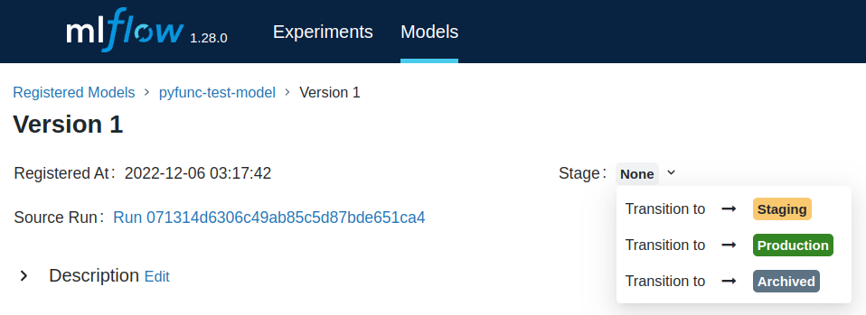

# Inference-System-ML-Pipeline
Pipeline to deploy models in the SPIRA Inference System


## Instructions to deploy a new model server to Inspirada machine

Firstly, your model should follow the template below:

```
class ModelTemplate(PythonModel):

    def load_context(self, context) -> None:
      """
        This method is called as soon as the model is instantiated.

        The same context will also be available during calls to predict, 
        but it may be more efficient to override this method and load 
        artifacts from the context at model load time.

        :param context: A :class:`~PythonModelContext` instance containing artifacts that the model
                        can use to perform inference.
      """
      pass

    def predict(self, context, model_input) -> Tuple[List[float],str]:
      """
      Evaluates the inference files and metadata and returns a prediction.

      :param context: A :class:`~PythonModelContext` instance containing artifacts that the model
                      can use to perform inference.
      :param model_input: A list of two dictionaries, the first containing inference metadata and
                      the second containing audio file bytearrays.
      
      returns: A Tuple where the first element is a list of numbers and the second is the diagnosis
      string ("positive", "negative", "inconclusive"). 
      """
      pass
```

Here are examples of the expected input and output:

Input:
```
[{
    'id':'638f56f70acda5864ee0203a',
    'model_id': '629f992d45cda830033cf4cd',
    'rgh': '12345678',
    'mask_type': 'THICK',
    'gender': 'Feminino',
    'covid_status': 'TRUE',
    'local': 'Outro',
    'age': 23,
    'cid': '12345',
    'bpm': '17',
    'respiratory_frequency': '13',
    'respiratory_insufficiency_status': 'true',
    'location': 'location',
    'last_positive_diagnose_date': '2022-12-01',
    'hospitalized': 'true',
    'hospitalization_start': '2022-12-02',
    'hospitalization_end': '2022-12-05',
    'spo2': '23',
    'status': 'completed',
    'user_id': '638edab749a120cb7cdb295d',
    'created_in': '2022-12-06 14:51:35.771148'
}, 
{'aceite': {'content': <bytearray>},'sustentada': {'content': <bytearray>}, 'parlenda': {'content': <bytearray>}, 'frase':{'content': <bytearray>}}]
```

Output:
```
[0.1,0.2,0.3], 'negative'
```

Once your model class is ready, run:

```
python3 pipeline.py
```
using the inference-system deploy user (note that the repository was already cloned to the machine). The file will ask for a model name. 
The name of the model should match the regex [a-zA-Z0-9\-\_]+.

**Note that this script can also be used to update models**, in which case you can run pipeline.py and do the same procedure in MLFlow UI with the latest version. 

**Be careful not to put the name of an existent model unknowingly**, otherwise you will be overwriting it with a new version.

Once the execution ends, access the MLFlow UI. Your model should be registered there. If the model is new, select Version 1 and change it to Production like in the example screenshot below:



**The pipeline should have generated a new directory under ~/model_deploys/name-of-the-model.**
Create a symbolic link between a .service file in the directory /etc/systemd/system and the docker-compose-model@.service file in this new directory and start the service.

You may need to ask for someone with the right credentials to execute this last step.

Once tou are finished, the model should be available for inferences.
